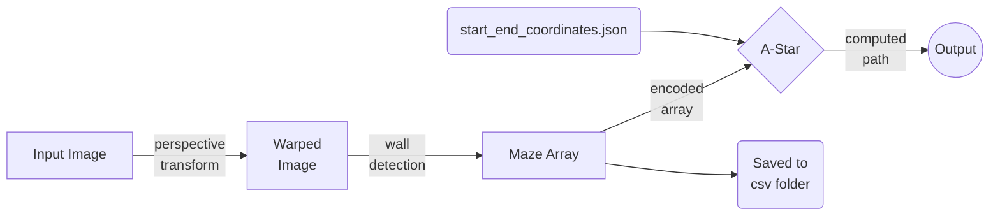

# Maze-Solver
Involving Computer vision techniques and path planning algorithm(A-Star) to find the path through a maze.

## Dependencies

 - pip install numpy
 - pip install python-csv
 - pip install opencv-contrib-python
 - pip install pypi-json
 
## Exploring files and folders
 - test_cases : *includes maze images*
	 - csv
	 - maze encoded output generated by maze_processor.py
	 - 10 maze images 
 - start_end_coordinates.json : *contains start and stop points for each maze image* 
 - maze_processor.py : *applies image processing techniques on maze images and returns a encoded maze in form of array*
 - display_path.py : *uses a-star agorithm to find the path using encoded maze array recieved from maze_processer.py, and displays path on image.*

## Methodology

||  |  |
|:--:|:--:|:--:|
| 1. Input Image| 2. Warped Image| 3. Output Image|

> Green Dot ⇒ Start Point
> Red Dot ⇒ End point
