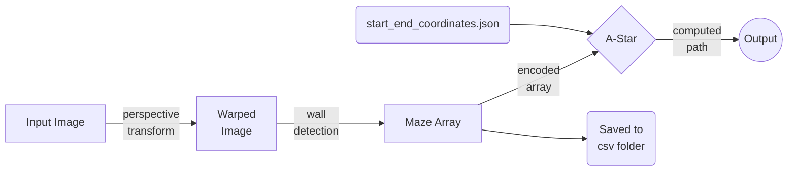

# Maze-Solver
Involving Computer vision techniques and path planning algorithm(A-Star) to find the path through a maze.
 This project was a subtask of eYRC 2020-2021 Competition

## Dependencies

 - pip install numpy
 - pip install python-csv
 - pip install opencv-contrib-python
 - pip install pypi-json
 
## Exploring files and folders
 - test_cases : *includes maze images*
	 - csv
	 - maze encoded output generated by maze_processor.py
	 - 10 maze images 
 - start_end_coordinates.json : *contains start and stop points for each maze image* 
 - maze_processor.py : *applies image processing techniques on maze images and returns a encoded maze in form of array*
 - display_path.py : *uses a-star agorithm to find the path using encoded maze array recieved from maze_processer.py, and displays path on image.*

## Methodology

||  |  |
|:--:|:--:|:--:|
| 1. Input Image| 2. Warped Image| 3. Output Image|

> Green Dot ⇒ Start Point 
> Red Dot ⇒ End point

## A-Star
A*  (pronounced "A-star") is a  [graph traversal](https://en.wikipedia.org/wiki/Graph_traversal "Graph traversal")  and  [path search](https://en.wikipedia.org/wiki/Pathfinding "Pathfinding")  [algorithm](https://en.wikipedia.org/wiki/Algorithm "Algorithm"), which is used in many fields of computer science due to its completeness, optimality, and optimal efficiency.  One major practical drawback is its    space complexity, as it stores all generated nodes in memory. Thus, in practical  [travel-routing systems](https://en.wikipedia.org/wiki/Travel-routing_system "Travel-routing system"), it is generally outperformed by algorithms which can pre-process the graph to attain better performance, as well as memory-bounded approaches; however, A* is still the best solution in many cases.

It can be seen as an extension of  [Dijkstra's algorithm](https://en.wikipedia.org/wiki/Dijkstra%27s_algorithm "Dijkstra's algorithm"). A* achieves better performance by using  [heuristics](https://en.wikipedia.org/wiki/Heuristic_(computer_science) "Heuristic (computer science)")  to guide its search. Compared to Dijkstra's algorithm, the A* algorithm only finds the shortest path from a specified source to a specified goal, and not the shortest-path tree from a specified source to all possible goals. This is a necessary trade-off for using a specific-goal-directed heuristic. For Dijkstra's algorithm, since the entire shortest-path tree is generated, every node is a goal, and there can be no specific-goal-directed heuristic.

[You can find a detailed explanation of A* here](https://www.geeksforgeeks.org/a-search-algorithm/) ;)
